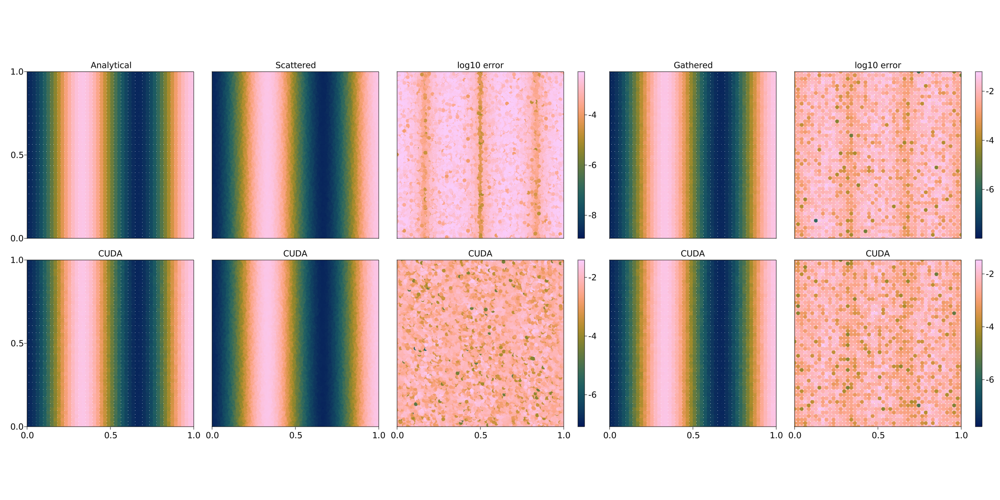
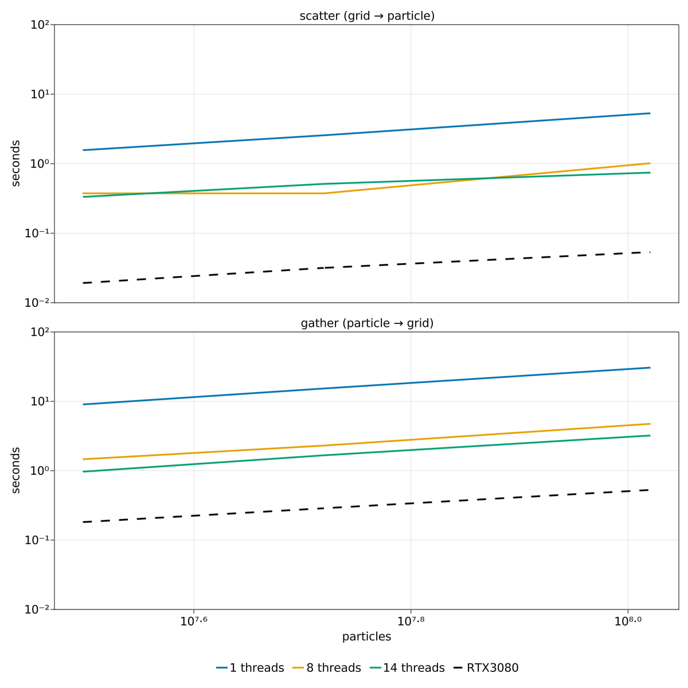

# StencilInterpolations.jl


```Julia
# model domain
lx = ly = lz = 1
x = LinRange(0, lx, nx)
y = LinRange(0, ly, ny)
z = LinRange(0, lz, nz)

# field to interpolate
F = [-sin(2*zi)*cos(3*π*xi) for xi in x, _ in y, zi in z]
F0 = deepcopy(F)
```

Generate set of `nxcell` random particles per grid cell
```Julia
ncells = (nx-1)*(ny-1)*(nz-1)
px, py, pz = zeros(nxcell*ncells), zeros(nxcell*ncells), zero(nxcell*ncells)
for i in 1:nx-1
    for j in 1:ny-1, k in 1:nz-1
        # lowermost-left corner of the cell
        x0, y0, z0 = x[i], y[j], z[k]
        # cell index
        cell = i + (nx-1)*(j-1) + (nx-1)*(ny-1)*(k-1)
        for l in 1:nxcell
            px[(cell-1)*nxcell + l] = rand()*dx + x0
            py[(cell-1)*nxcell + l] = rand()*dy + y0
            pz[(cell-1)*nxcell + l] = rand()*dz + z0
        end
    end
end
particle_coords = (px, py, pz)
```

On CPU
```Julia
# scattering operation (tri-linear interpolation)
Fp = scattering((x, y, z), F, particle_coords)

# gathering operation (inverse distance weighting)
gathering!(F, Fp, (x, y, z), particle_coords)
```

Using CUDA
```Julia
# move arrays to GPU
Fpd = CUDA.zeros(Float64, length(px))
Fd = CuArray(F)
Fd0 = deepcopy(Fd)
particle_coords_dev = CuArray.(particle_coords)

# scattering operation (tri-linear interpolation)
scattering!(Fpd, (x, y, z), Fd,particle_coords_dev)

# gathering operation (inverse distance weighting)
fill!(Fd, 0.0)
gathering!(Fd, Fpd, (x, y, z), particle_coords_dev)
```
Resulting interpolated fields


# Performance
<!-- ## Bi-linear interpolation and 2D weighted inverse distance interpolation


 -->

## Tri-linear interpolation and 3D weighted inverse distance interpolation



